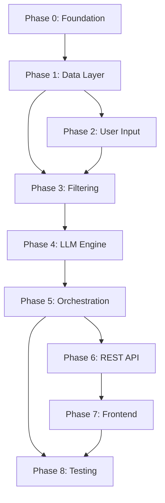

# Phase-Wise Implementation Plan

AI-Powered Restaurant Recommendation System (Zomato Use Case)

This plan translates [context.md](./context.md) and [architecture.md](./architecture.md) into a sequenced build roadmap. Each phase has clear deliverables, tasks, and acceptance criteria. Phases are ordered by dependency — later phases assume earlier ones are complete.

---

## Table of Contents

1. [Overview](#1-overview)
2. [Phase 0 — Project Foundation](#phase-0--project-foundation)
3. [Phase 1 — Data Ingestion & Storage](#phase-1--data-ingestion--storage)
4. [Phase 2 — User Input & Validation](#phase-2--user-input--validation)
5. [Phase 3 — Filtering & Candidate Preparation](#phase-3--filtering--candidate-preparation)
6. [Phase 4 — LLM Recommendation Engine](#phase-4--llm-recommendation-engine)
7. [Phase 5 — Application Orchestration](#phase-5--application-orchestration)
8. [Phase 6 — REST API](#phase-6--rest-api)
9. [Phase 7 — Frontend / Output Layer](#phase-7--frontend--output-layer)
10. [Phase 8 — Testing, Hardening & Deployment](#phase-8--testing-hardening--deployment)
11. [Timeline Summary](#timeline-summary)
12. [Requirements Traceability](#requirements-traceability)

---

## 1. Overview

### Design Principles (carry through all phases)

| Principle | Implementation implication |
|-----------|---------------------------|
| Structured-first, LLM-second | Filtering must be complete before any LLM call |
| Explainability | Every result includes an AI-generated reason |
| Separation of concerns | One module per layer; no cross-layer leakage |
| Cost efficiency | Cap candidates at 30; compact JSON in prompts |
| Graceful degradation | Fallback ranker when LLM fails |

### Target End State

A working application where a user submits preferences (location, budget, cuisine, rating, extras), receives the top 5 ranked restaurants with explanations, and sees results in a web UI or via API — all backed by the Hugging Face Zomato dataset.

### Suggested Project Layout

```
zomato-milestone/
├── docs/
├── src/
│   ├── main.py
│   ├── config.py
│   ├── data/           # loader, preprocessor, models, store
│   ├── services/       # filter, orchestrator, formatter
│   ├── llm/            # client, prompt_builder, response_parser
│   └── api/            # routes, schemas
├── tests/
├── data/cache/
├── .env.example
├── requirements.txt
└── README.md
```

---

## Phase 0 — Project Foundation

**Goal:** Establish the repository skeleton, dependencies, and configuration so all subsequent phases share a consistent foundation.

**Duration estimate:** 0.5–1 day

### Tasks

| # | Task | Output |
|---|------|--------|
| 0.1 | Initialize Python project (3.11+) | `requirements.txt`, virtual environment |
| 0.2 | Add core dependencies | `datasets`, `pandas`, `pydantic`, `fastapi`, `uvicorn`, `python-dotenv`, `pytest`, LLM SDK |
| 0.3 | Create directory structure per architecture | `src/`, `tests/`, `data/cache/` |
| 0.4 | Add `src/config.py` | Env vars: `LLM_PROVIDER`, `LLM_API_KEY`, budget tier thresholds, candidate cap |
| 0.5 | Add `.env.example` | Documented placeholders for API keys and config |
| 0.6 | Add `README.md` | Setup instructions, env config, how to run |

### Acceptance Criteria

- [ ] `pip install -r requirements.txt` succeeds
- [ ] `src/config.py` loads settings from environment with sensible defaults
- [ ] Project layout matches architecture document
- [ ] `.env.example` documents all required variables

### Dependencies

None — starting phase.

---

## Phase 1 — Data Ingestion & Storage

**Goal:** Load the Zomato dataset from Hugging Face, normalize it into a canonical `Restaurant` model, and serve it from an in-memory store with disk cache.

**Duration estimate:** 1–2 days

**Maps to context:** Load dataset, preprocess fields

### Tasks

| # | Task | Module | Details |
|---|------|--------|---------|
| 1.1 | Define `Restaurant` schema | `src/data/models.py` | `id`, `name`, `location`, `cuisines`, `rating`, `cost_for_two`, `budget_tier`, optional `raw` |
| 1.2 | Implement `DatasetLoader` | `src/data/loader.py` | Fetch `ManikaSaini/zomato-restaurant-recommendation` via `datasets` library |
| 1.3 | Implement `Preprocessor` | `src/data/preprocessor.py` | Normalize location strings; parse cuisines; coerce ratings; map cost to budget tier |
| 1.4 | Define budget tier mapping | `src/config.py` + preprocessor | Low ≤ ₹500, Medium ₹501–1500, High > ₹1500 (adjust after inspecting data) |
| 1.5 | Implement `RestaurantStore` | `src/data/store.py` | In-memory `list[Restaurant]`; load on startup; optional JSON/Parquet disk cache |
| 1.6 | Handle bad rows | preprocessor | Drop or flag invalid ratings; handle null costs |
| 1.7 | Add cache logic | loader + store | Write processed data to `data/cache/`; skip download if cache exists |
| 1.8 | Write unit tests | `tests/test_preprocessor.py` | Tier mapping, null handling, cuisine parsing |

### Acceptance Criteria

- [ ] Dataset downloads (or loads from cache) without manual intervention
- [ ] Every record conforms to the `Restaurant` Pydantic/dataclass schema
- [ ] Budget tiers are assigned consistently
- [ ] Store exposes `all()`, `get_by_id()`, and helper queries for locations/cuisines
- [ ] Second startup uses cache (no re-download)
- [ ] Preprocessor tests pass

### Dependencies

Phase 0

### Notes

Inspect the raw dataset early (Phase 1, task 1.2) to confirm column names and adjust field mapping before writing the preprocessor.

---

## Phase 2 — User Input & Validation

**Goal:** Define and validate the `UserPreferences` schema that drives filtering and LLM prompting.

**Duration estimate:** 0.5–1 day

**Maps to context:** Build user input collection

### Tasks

| # | Task | Module | Details |
|---|------|--------|---------|
| 2.1 | Define `UserPreferences` model | `src/api/schemas.py` | `location`, `budget`, `cuisine`, `min_rating`, `additional`, `num_recommendations` |
| 2.2 | Implement validation rules | schemas / validator | Location non-empty; budget enum; rating 0.0–5.0; cuisine optional; num_recommendations 1-10 |
| 2.3 | Location validation | validator | Match against known cities from `RestaurantStore` |
| 2.4 | Cuisine fuzzy match helper | validator | Optional normalization against dataset cuisine values |
| 2.5 | Define API error model | `src/api/schemas.py` | Field-level `400` responses |

### Acceptance Criteria

- [ ] Invalid budget values rejected with clear error messages
- [ ] Unknown locations flagged (or suggested via closest match)
- [ ] Valid preferences serialize to JSON for downstream use
- [ ] `additional` free-text passes through unchanged for LLM

### Dependencies

Phase 1 (needs store for location/cuisine lists)

---

## Phase 3 — Filtering & Candidate Preparation

**Goal:** Reduce the full dataset to a relevant shortlist (≤ 30 candidates) using deterministic filters, with progressive constraint relaxation when results are sparse.

**Duration estimate:** 1–2 days

**Maps to context:** Implement filtering logic

### Tasks

| # | Task | Module | Details |
|---|------|--------|---------|
| 3.1 | Implement `FilterService` | `src/services/filter_service.py` | Filter by location → min_rating → cuisine → budget |
| 3.2 | Cap candidates at N | filter service | Default 30; configurable via `config.py` |
| 3.3 | Progressive relaxation | filter service | If < 3 candidates, relax cuisine then budget; record relaxations |
| 3.4 | Implement `CandidateBuilder` | filter service | Produce compact JSON: `id`, `name`, `cuisine`, `rating`, `cost`, `budget_tier` |
| 3.5 | Implement `PromptAssembler` | `src/llm/prompt_builder.py` (stub) | Merge preferences + candidate JSON into prompt template |
| 3.6 | Write unit tests | `tests/test_filter.py` | Location match, budget tier, rating threshold, cap, relaxation |

### Filter Order (from architecture)

```
1. Location  — case-insensitive match
2. Min rating — rating >= threshold
3. Cuisine   — substring/token match
4. Budget    — budget_tier == user budget
5. Cap at 30
```

### Acceptance Criteria

- [ ] Filtering returns only restaurants matching location and budget (before relaxation)
- [ ] Candidate list never exceeds 30 items
- [ ] Relaxation triggers when candidates < 3 and is noted in metadata
- [ ] Compact candidate JSON is LLM-ready (essential fields only)
- [ ] Filter unit tests cover edge cases (no matches, partial cuisine match)

### Dependencies

Phases 1, 2

---

## Phase 4 — LLM Recommendation Engine

**Goal:** Rank candidates and generate explanations via an LLM, with a rule-based fallback when the provider is unavailable.

**Duration estimate:** 2–3 days

**Maps to context:** Design LLM prompt, integrate LLM for ranking and explanation

### Tasks

| # | Task | Module | Details |
|---|------|--------|---------|
| 4.1 | Define `LLMClient` interface | `src/llm/client.py` | `complete(messages) → LLMResponse` |
| 4.2 | Implement provider(s) | `src/llm/client.py` | Groq SDK; selected via `LLM_PROVIDER` env |
| 4.3 | Implement `PromptBuilder` | `src/llm/prompt_builder.py` | System + user messages per architecture spec |
| 4.4 | Define LLM output schema | models | `summary`, `recommendations[{restaurant_id, rank, explanation}]` |
| 4.5 | Implement `ResponseParser` | `src/llm/response_parser.py` | Parse JSON; validate IDs against candidates; reject hallucinations; **deduplicate by `restaurant_id`** (keep first occurrence, discard repeats) |
| 4.6 | JSON repair retry | response parser | One retry with repair prompt on malformed output |
| 4.7 | Implement `FallbackRanker` | `src/llm/client.py` or separate module | Weighted score: 0.5 rating + 0.3 cuisine + 0.2 budget match |
| 4.8 | Merge LLM output with store | response parser | Enrich with full restaurant metadata (name, cost, cuisine) |
| 4.9 | Write unit tests | `tests/test_response_parser.py` | Valid JSON, hallucinated IDs, malformed JSON, fallback path, **duplicate restaurant_id in LLM output** |

### Prompt Contract (from architecture)

**System:** Restaurant assistant; rank top 5; explain each; JSON only; no invented restaurants.

**User:** Preferences + candidate JSON + output schema.

### Acceptance Criteria

- [ ] LLM returns top 5 ranked recommendations with explanations
- [ ] Every `restaurant_id` in the response appears **at most once** (deduplication enforced in `ResponseParser`)
- [ ] Every `restaurant_id` in the response exists in the candidate set
- [ ] Hallucinated restaurants are discarded
- [ ] Fallback ranker returns top 5 with generic explanation when LLM fails
- [ ] Response includes optional `summary` field
- [ ] Token budget stays within ~2,000–3,000 input tokens for 30 candidates
- [ ] Parser tests pass

### Dependencies

Phase 3

### Notes

Develop and test the prompt with a small candidate set before wiring the full pipeline. Log LLM latency and parse failures for observability.

---

## Phase 5 — Application Orchestration

**Goal:** Wire all layers into a single request lifecycle: validate → filter → LLM → format.

**Duration estimate:** 1 day

**Maps to context:** End-to-end workflow integration

### Tasks

| # | Task | Module | Details |
|---|------|--------|---------|
| 5.1 | Implement `RecommendationOrchestrator` | `src/services/orchestrator.py` | Coordinate validate → filter → prompt → LLM → parse |
| 5.2 | Implement `ResponseFormatter` | `src/services/formatter.py` | Map to `RecommendationDisplay` DTOs |
| 5.3 | Add response metadata | formatter | `candidates_considered`, `filters_applied`, `llm_used` flag |
| 5.4 | Wire startup lifecycle | `src/main.py` | Load dataset into store on app startup |
| 5.5 | Handle zero-candidate case | orchestrator | Return structured empty result (feeds `404` in API) |
| 5.6 | End-to-end smoke test | manual / test | Delhi + medium budget → 5 recommendations |

### Request Lifecycle

```
User prefs → Validator → FilterService → PromptBuilder → LLMClient
         → ResponseParser → Formatter → Response
```

### Acceptance Criteria

- [ ] Single orchestrator call produces a complete recommendation response
- [ ] Dataset loads once at startup (not per request)
- [ ] Zero candidates handled without crash
- [ ] Fallback path sets `llm_used: false` in metadata
- [ ] Target latency < 5 s for a typical request (LLM-bound)

### Dependencies

Phases 2, 3, 4

---

## Phase 6 — REST API

**Goal:** Expose the recommendation pipeline via a documented FastAPI REST interface.

**Duration estimate:** 1–2 days

**Maps to context:** Programmatic access to recommendations

### Tasks

| # | Task | Module | Details |
|---|------|--------|---------|
| 6.1 | Set up FastAPI app | `src/main.py`, `src/api/routes.py` | App factory, CORS if needed |
| 6.2 | `GET /health` | routes | Status + `dataset_loaded` flag |
| 6.3 | `GET /meta/locations` | routes | Distinct cities from store |
| 6.4 | `GET /meta/cuisines` | routes | Distinct cuisines from store |
| 6.5 | `POST /recommendations` | routes | Accept `UserPreferences`; return formatted response |
| 6.6 | Error responses | routes | `400` validation, `404` no matches, `503` dataset not loaded |
| 6.7 | OpenAPI docs | FastAPI auto | Verify at `/docs` |

### API Contract

**POST `/recommendations`**

Request:
```json
{
  "location": "Bangalore",
  "budget": "medium",
  "cuisine": "Italian",
  "min_rating": 4.0,
  "additional": "family-friendly, quick service"
}
```

Response: `summary`, `recommendations[]`, `meta`.

### Acceptance Criteria

- [ ] All four endpoints respond correctly
- [ ] `/health` reports dataset load status
- [ ] `/meta/*` returns accurate lists from the dataset
- [ ] Invalid requests return `400` with field-level errors
- [ ] No matches return `404` with helpful message
- [ ] OpenAPI schema matches implementation

### Dependencies

Phase 5

---

## Phase 7 — Frontend / Output Layer

**Goal:** Build a user-facing interface to collect preferences and display recommendation cards.

**Duration estimate:** 2–3 days

**Maps to context:** Display name, cuisine, rating, cost, AI explanation

### Option A — Streamlit (recommended for MVP)

| # | Task | Details |
|---|------|---------|
| 7.1 | Preference form | Location dropdown (from `/meta/locations`), budget radio, cuisine dropdown, min rating, notes, number of recommendations select |
| 7.2 | Submit handler | Call `POST /recommendations` or invoke orchestrator directly |
| 7.3 | Loading state | Spinner during LLM call (~2–5 s) |
| 7.4 | Results cards | Rank, name, rating, cost, cuisine, explanation per card |
| 7.5 | Summary banner | Display LLM overview text |
| 7.6 | Empty / error states | "No restaurants found" and retry option |

### Option B — React + FastAPI (production-style)

Same features as Option A, with API client, component-based cards, and responsive layout.

### UI States

| State | Behavior |
|-------|----------|
| Idle | Form ready |
| Loading | Spinner |
| Success | Summary + cards #1–#5 |
| Empty | Relax-filters suggestion |
| Error | User-friendly message + retry |

### Acceptance Criteria

- [ ] User can submit all preference fields from the UI
- [ ] Results show all five required fields per recommendation
- [ ] No duplicate restaurant cards are displayed (each restaurant appears at most once)
- [ ] Loading, success, empty, and error states all work
- [ ] Location and cuisine dropdowns populated from API meta endpoints
- [ ] End-to-end demo: form → recommendations displayed in < 10 s

### Dependencies

Phase 6 (or Phase 5 if UI calls orchestrator directly)

---

## Phase 8 — Testing, Hardening & Deployment

**Goal:** Ensure reliability, observability, and deployability; close all context checklist items.

**Duration estimate:** 2–3 days

### Tasks

| # | Task | Details |
|---|------|---------|
| 8.1 | Unit test coverage | Filter, preprocessor, response parser (target: core logic covered) |
| 8.2 | Integration test | Full pipeline with mocked LLM client |
| 8.3 | Error handling audit | Dataset download retry (3×); stale cache fallback; LLM timeout |
| 8.4 | Logging | Filter counts, LLM latency, parse failures |
| 8.5 | Security review | API keys in env only; no secrets in logs or code |
| 8.6 | Performance check | Confirm p95 < 5 s with real LLM |
| 8.7 | README completion | Architecture overview, API usage, UI screenshots |
| 8.8 | Optional: Docker | Container with mounted `data/cache/` and secrets via env |
| 8.9 | Optional: CI | `pytest` on push |

### Error Handling Matrix

| Scenario | Expected behavior |
|----------|-------------------|
| Dataset download fails | Retry 3×; use stale cache |
| Zero candidates | `404` + relax-filters suggestion |
| LLM timeout / rate limit | Fallback ranker; `llm_used: false` |
| Malformed LLM JSON | Repair retry; then fallback |
| Hallucinated restaurant ID | Discard; fill from next valid entry |
| Invalid user input | `400` with field errors |

### Acceptance Criteria

- [ ] `pytest` passes for all test modules
- [ ] Integration test covers happy path and LLM-failure fallback
- [ ] All context checklist items verified (see below)
- [ ] README enables a new developer to run the app in < 15 minutes
- [ ] `/health` suitable for container health checks

### Dependencies

Phases 1–7

---

## Timeline Summary

| Phase | Focus | Estimate | Cumulative |
|-------|-------|----------|------------|
| 0 | Project foundation | 0.5–1 day | ~1 day |
| 1 | Data ingestion & storage | 1–2 days | ~3 days |
| 2 | User input & validation | 0.5–1 day | ~4 days |
| 3 | Filtering & candidates | 1–2 days | ~6 days |
| 4 | LLM recommendation engine | 2–3 days | ~9 days |
| 5 | Application orchestration | 1 day | ~10 days |
| 6 | REST API | 1–2 days | ~12 days |
| 7 | Frontend / output | 2–3 days | ~15 days |
| 8 | Testing & deployment | 2–3 days | ~18 days |

**Total estimated effort:** ~12–18 working days for a single developer (MVP with Streamlit).

Phases 6 and 7 can overlap partially (API first, then UI against live endpoints). Phase 4 is the highest-risk phase (LLM integration) — allocate buffer for prompt tuning.

---

## Requirements Traceability

Maps [context.md](./context.md) checklist items to implementation phases.

| Context Requirement | Phase | Key Deliverable |
|---------------------|-------|-----------------|
| Load Zomato dataset from Hugging Face | 1 | `DatasetLoader` |
| Preprocess and extract relevant fields | 1 | `Preprocessor`, `Restaurant` model |
| Build user input collection | 2, 7 | `UserPreferences` schema + UI form |
| Implement filtering logic | 3 | `FilterService`, `CandidateBuilder` |
| Design LLM prompt for ranking | 4 | `PromptBuilder` |
| Integrate LLM for recommendations | 4 | `LLMClient`, `ResponseParser` |
| Display results (name, cuisine, rating, cost, explanation) | 5, 7 | `ResponseFormatter` + UI cards |

### Architecture Component Map

| Architecture Component | Phase |
|------------------------|-------|
| Data Ingestion Module | 1 |
| User Input Module | 2 |
| Integration Layer (Filter & Prepare) | 3 |
| Recommendation Engine (LLM) | 4 |
| Application Layer (Orchestrator, Formatter) | 5 |
| API Design | 6 |
| Frontend / Output Layer | 7 |
| Error Handling & Fallbacks | 4, 8 |
| Deployment Architecture | 8 |

---

## Suggested Build Order (Critical Path)



**Minimum viable demo path (fastest):** 0 → 1 → 2 → 3 → 4 → 5 → 7 (Streamlit calling orchestrator directly, skip API).

**Production-style path:** Complete all phases 0–8 in order.

---

## Future Extensions (post-MVP)

Deferred per [architecture.md](./architecture.md) Section 14:

- Vector search for semantic matching on `additional` preferences
- User history and personalized prompts
- Multi-location / geocoding ("near me")
- Streaming LLM explanations in the UI
- A/B testing of prompt variants
- Feedback loop (thumbs up/down)

---

*Derived from [context.md](./context.md) and [architecture.md](./architecture.md).*
